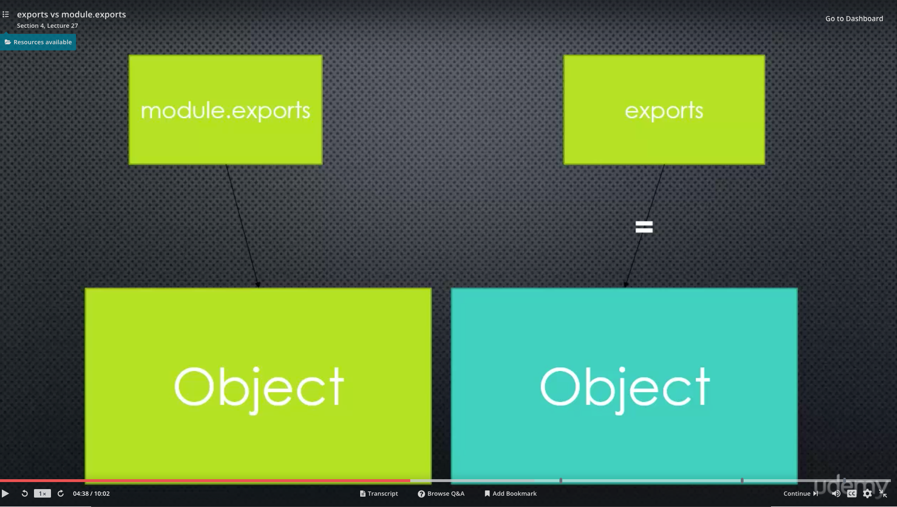

# Learn and Understand NodeJS

This is a course by Anthony Alicea that I'm taking on Udemy

As much as I love taking handwritten notes, I need to get used to doing most things with my keyboard and computer, so I'll be taking notes on this README file.

Since my two goals after this are to create:

1) An alarm clock butler for my raspberry pi
2) To rebuild my website with Node.JS, Express.JS, and ReactJS/GastsbyJS so I can have a knowledge of the website that we're planning on.

These files will act as solid template to create both of those.

#To-Do List
```javascript
//TODO: Read Over and Understand NodeJS Core Modules
//TODO: Look deeper into Events and the Event Emitter
```

## Conceptual Aside: Modules

* Modules: A reusable block of code whose existence does not accidentally impact other code
* JS didn't have this until ES6
* So NodeJS needed to create this

* CommonJS modules: an agreed upon standard on how code modules should be structured.

## JavaScript Aside: First-Class Functions and Function Expressions

* Everything you can with other types, you can do with functions.
* Function expression
* `var foo = function(bar){};`
* You can create functions on the fly
* Invoke == call == run (double equals used intentionally)
* Example:

```javascript
function index() {
    console.log('hi');
}

// functions are first-class
function logGreeting(fn) {
    fn();
};
logGreeting(index);

//function expression
var greetMe = function () {
    console.log('Howdy, World!');
}
greetMe();

// it's first-class
logGreeting(greetMe);

// use a function expression on the fly
logGreeting(function () {
    console.log('Howdy, yet again, world!');
});
```

## Modules

Modules not only should encapsulate the code, but also ensures that the code does not affect other code.

So you have to explicitly make the functions of modules explicitly available to the js file that is requiring that module.

`module.export =` exposes functions to the requiring file

This is why you do `var index = ...` to require a NodeJS file.

The `.js` ending is unecessary because Node.JS assumes.

Require and Export are from the NodeJS Core

## By Value vs. By Reference

Running this JavaScript code is a handy way of demonstrating the distinction:

```javascript
var a = 3;

var b = a;

var c;

console.log(b);

function testy(variable) {
    c = variable;
    return c;
};
testy(a);
console.log(c);

var a = 5;

console.log(a);
console.log(b);
console.log(c);

```

So is this [gif](https://media.giphy.com/media/xUPGcLrX5NQgooYcG4/giphy.gif), while we're at it.

## IIFEs

basically an old school JS hack to make modules without modules

## How do Node Modules Really Work?: module.exports and require

**require** is a function, that you pass a 'path' to

**module.exports** is what the require function *returns*

this works because your code is actually wrapped in a **function** that is given these things as function parameters

## More on Require

If require can't find the name in a `.js` file, it will look for a folder with that name.

So you create other `.js` files within that folder in addition to an `index.js` file.

Then inside the index file, you do something like this:

```javascript
var english = require('./english');
var spanish = require('./spanish');

module.exports = {
    english: english,
    spanish: spanish
};
```

Say this is all within the folder **greet**. You'll call it like you normally would (`var greet = require('./greet);`) and then you'll run the functions like:

```javascript
greet.english();
greet.spanish();
```

You can also add `.json` files and the `require` function will do that for us as long as you specifically require `<file>.json`. This will allow you pass in JSON as JavaScript objects.

## exports vs module.exports

```javascript
(function (exports, require, module, __filename, __dirname) {
    var greet = function() {
        console.log('Hello!');
    };
    module.exports = greet;
});

fn(module.exports, require, module, filename, dirname);

return module.exports;
```

exports is short-hand for module.exports, they are both pointing towards the same point in memory.

Why the two names then? Related to a quirk in JS about how Objects are passed within memory.

require function returns module.exports which is a separate variable from exports which receives that value.

Exports does not work for all the patterns we've seen so far.

```javascript
exports = function () {
    console.log('What Hath God Wrought?');
}

console.log(exports);
console.log(module.exports);
```
^ That code produces

```javascript
[Function]
{}
```

So exports is a function now, but module.exports is still an empty object

**So what's really happening?**


So when the assignment operator is used on exports, it takes on that new value, leading to two different objects pointing to two different spots in memory.

So what's returned from require? module.exports, so that's a problem. And you'll get an error if you try and invoke it like normal.

So you can't change exports, but there is a way to mutate it without having this problem.

Whatya wanna do is...

```javascript
exports.greet = function () {
    console.log('What Hath God Wrought?');
}

console.log(exports);
console.log(module.exports);
```

**T.Alicea's recommendation is**

# JUST USE MODULE.EXPORTS! BE LAZY, FOR CRYING OUT LOUD!

## Requiring Native (Core) Modules

```javascript
var util = require('util');

var name = 'Tony';
var greeting = util.format('Hello, %s', name);
util.log(greeting);
```

Lots of interesting stuff that is already there. Definitely worth reading through the documentation.

## Modules and ES6

ES6 now has modules built-in.

We should see things move from node modules to ES6 modules

**For Example**
greet.js
```javascript
export function greet() {
    console.log('Hello');
}
```
app.js
```javascript
import * as greetr from 'greet';
greetr.greet();
```

## Conceptual Aside: Events

**Event:** Something that has happened in our app that we can respond to.
This is not limited to NodeJS. Found in many areas of software architecture and on many platforms.

In Node, we actually talk about two different kinds of events, but we tend to conflate the two.
On one hand you have
* **System Events** from the C++ Core (libuv): files, data from the internet, things that are !JavaScript
* **Custom Events** from the Event Emitter inside the JavasScript Core.

The Event Emitter is where we have custom events

 System Events is dealing with lower-level stuff that is closer to the metal.
 
 Very often the C++ core wraps its code in JS to make things easier.
 
### The JavaScript is faking events!!!

## So What Is Actually Going On?

We're attaching properties that are arrays of functions to an object and calling those events.
We're calling them events because it makes it easier to think about them.

## The Node Event Emitter

**Event Listener:** The code that responds to an event. In JavaScript's case, the listener will be a function.


events.js s where the Node.JS event emitter is

#### The Event Emitter relies on **magic strings**: A strong has some special meaning in our code
This is bad because it makes it easy to for a typo to cause a bug, and hard for tools to help us find it.

**how to deal with this!**

create a config.js
```javascript
module.exports = {
    events: {
        GREET: 'greet',
        FILESAVED: 'filesaved',
        FILEOPENED: 'fileopened'
    }
};
```

and add it to your code.

Many NodeJS modules are built on events.js

#JavaScript Aside:
## Object.create and Prototypes

```javascript
//how prototypes works

var person = {
    firstname: 'Name',
    lastname: 'Name',
    greet: function () {
        return "hello, " + this.firstname + ' ' + this.lastname;
    }
}

var john = Object.create(person);
john.firstname = 'John';
john.lastname = 'Doe';

var jane = Object.create(person);
jane.firstname = 'Jane';
jane.lastname = 'Smith';

var john2 = Object.create(person);
// john2.firstname = 'John';
john2.lastname = 'Doe';

var jane2 = Object.create(person);
jane2.firstname = 'Jane';
// jane2.lastname = 'Smith';

console.log(person.greet());
console.log(john.greet());
console.log(jane.greet());
console.log(john2.greet());
console.log(jane2.greet());
```

**The key concept in node is that many of the things in NodeJS have events.js down their prototype chain!!!**


#JavaScript Aside
##Node, ES6, and Template Literals

Will I need a `jsconfig.json` file with

```json
{
    "compilerOptions": {
        "target": "ES6"
    }
}
```

in it?

Anyways a template literal works like this:

```javascript
var name = 'Charles';
var hello = `Howdy, ${name}`;
console.log(hello);
```

#JavaScript Aside
##.call and .apply
```javascript
var obj = {
    name: 'Charles',
    greet: function (param1, param2) {
        console.log(`Howdy, ${this.name}! \n here is a parameter: ${param1} \n okay, now here is another: ${param2}!`);
    }
}

obj.greet("hello", "hola");
//.call allows you to change props on the object; you add parameters at the end like so
obj.greet.call({name: 'Catherine'}, "hello", "hola");
//.apply works just like .call except you add an array of the parameters
obj.greet.apply({name: 'User'}, ["hello", "hola"]);

```


#JavaScript Aside
##ES6 Classes

A new way to build objects syntactically but not under the hood which is why it is **syntatic sugar**

It's important to understand when something is syntatic sugar because it can lead to flawed assumptions about what is going on under the hood

So here's the old way:
```javascript
function Person(firstname, lastname) {

    this.firstname = firstname;
    this.lastname = lastname;

}

Person.prototype.greet = function () {
    console.log(`Hello ${this.firstname} ${this.lastname}`)
};

var john = new Person('John', 'Doe');
john.greet();

var jane = new Person('Jane', 'Doe');
jane.greet();

console.log(john.__proto__);
console.log(jane.__proto__);
console.log(john.__proto__ === jane.__proto__);
```

and here's the way using ES6 Classes:
```javascript
'use strict';

class Person {
    constructor(firstname, lastname) {
        this.firstname = firstname;
        this.lastname = lastname;
    }
    
    greet(){
        console.log(`Hello ${this.firstname} ${this.lastname}`)
    }
}

var john = new Person('John', 'Doe');
john.greet();

var jane = new Person('Jane', 'Doe');
jane.greet();

console.log(john.__proto__);
console.log(jane.__proto__);
console.log(john.__proto__ === jane.__proto__);

```

**But just make sure you understand what is ACTUALLY GOING ON!**

You can see another example in `inheriting-event-emitter/app.js`

You can also use class with modules. just do something like:
```javascript
module.exports = class Foo extends EventEmitter {
    constructor() {
        super();
        this.foo = "bar";
    }

    bar(data) {
        console.log(`foobar with some data: ${ data}`);
        this.emit('bar', data);
    }
}    
```


#Asynchronous Code,libuv, the event loop, streams, and more...

##JavaScript Aside
###JavaScript is Synchronous

The V8 engine runs one process at a time just like JavaScript which executes one line of code at a time.
NodeJS is asynchronous. It can do other things at a time.

The run-time environment allow for asynchronous coding.

Like the browser or, in this case, NodeJS

##Conceptual Aside: Callbacks
A functon passed to some other function, which we assume will be invoked at some point.
The function calls back' invoking the function you give it when it is done doing its work.

##libuv, the event loop, and non-blocking asynchronous code execution

Event Emitter is an object with properties which are arrays of functions.

System Events
handled by a C library called "libuv"

Inside libuv is an event loop where libuv checks to see if the queue is empty to do something.

**Insert Picture Diagram Here**

This also allows NodeJS code to be **non-blocking**: does other things without stopping your program from running. This is made possible by Node's asynchronous nature.

##Conceptual Aside:
###Streams and Buffers
**Buffer:** A temporary holding spot for data being moved from one place to another. It is intentionally limited in size because you don't want the data to be too big.

You just want to get some data and then move it along. 

Usually this data is being moved through a...

**Stream**: A sequence of data made available over time or pieces of data that eventually combine into a whole.

This allows us to process data as we go instead of waiting for it all to arrive.

Example: streaming a video vs downloading a video.

Usually it works like this:

Data comes down the stream, x amt is gathered in the buffer, and then that amount is processed
and then it happens again until the stream is complete. 

**Think about when a YouTube video is buffering!!!**

##Conceptual Aside:
###Binary Data, Character Sets, and Encoding

**Binary Data**: Data stored in binary (sets of 1s and 0s);
The core of the math that computers are based on. Each one or zero is called a bit or *'binary digit'*.

0101 is 5 because: 
`0*2^3 + 1*2^2 + 0*2^1b+ 1*2^0`

This is Base 2

Computers can easily recognize binary (electricity, ticker tape, etc.)

To store data other than numbers in computers, we need ways to represent other things which leads to...

**Character Sets:**
A representation of characters and numbers
Each character gets a number. Unicode and ASCII are character sets.

AND

**Character Encoding:**
How characters are stored in binary.
The numbers of (*code points*) are converted and stored in binary.

how many bits will we use to represent a number? In UTF-8, it represents 8 bits available to it.

**Historically, JavaScript has lacked a great deal of features for character encoding.** So NodeJS and V8 expands this and allows JavaScript to handle this better.

##Buffers

```javascript
var buf = new Buffer('Hello', 'utf8');
//outputs the binary data in hexadecimal data
console.log(buf); // <Buffer 48 65 6c 6c 6f>
console.log(buf.toString()); // Hello
//.toJSON converts the binary to a unicode character set
console.log(buf.toJSON()); // { type: 'Buffer', data: [ 72, 101, 108, 108, 111 ] }

buf.write('wo');
console.log(buf.toString());// wollo
//because the default length is set to those five characters in 'Hello', the 'wo' overrode the 'He'
```

##JavaScript Aside
###ES6 Typed Arrays

```javascript
//a byte is 8 bits; 8 bytes is 64 bits
var buffer = new ArrayBuffer(8);
//Int32, an integer stored with 32 bits; so you can store two numbers
var view = new Int32Array(buffer);
view[0] = 5;
view[1] = 15;
console.log(view);//Int32Array [ 5, 15 ]
view[2] = 45;
console.log(view);//still Int32Array [ 5, 15 ] because it only has room for those two numbers
```

##JavaScript Aside
###Callbacks
A function passed to some other function, which we assume will be invoked at some point.
The function 'calls back' by invoking the function you give it when it is done doing its work.

```javascript
function greet(callback) {
    console.log('Hello');
    var data = {
        name: 'Charles Pustejovsky'
    }
    callback(data);
}

function callbackFuntion(data) {
    console.log(`the function was invoked thanks to ${data.name}`);
}

greet(callbackFuntion);
//RESULTS
//Hello
//the function was invoked thanks to Charles Pustejovsky
```
